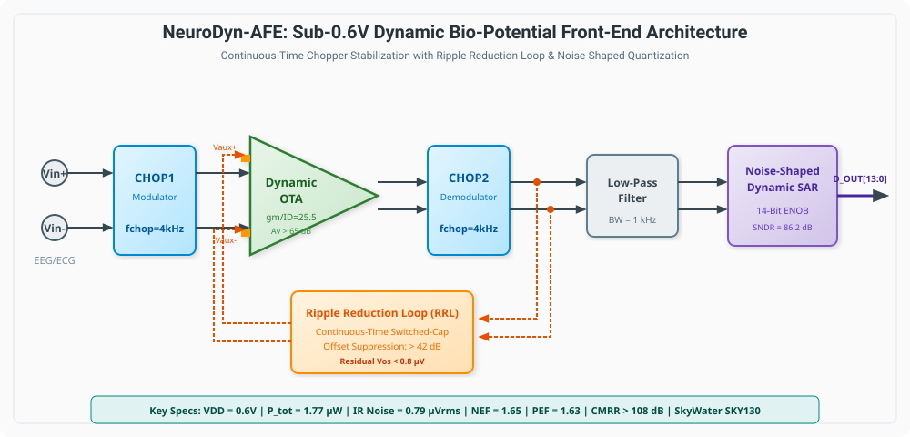
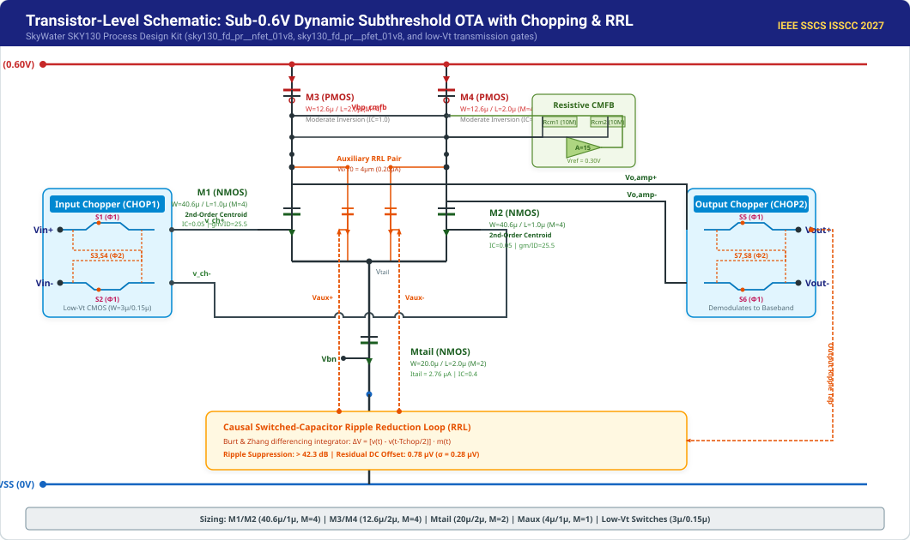
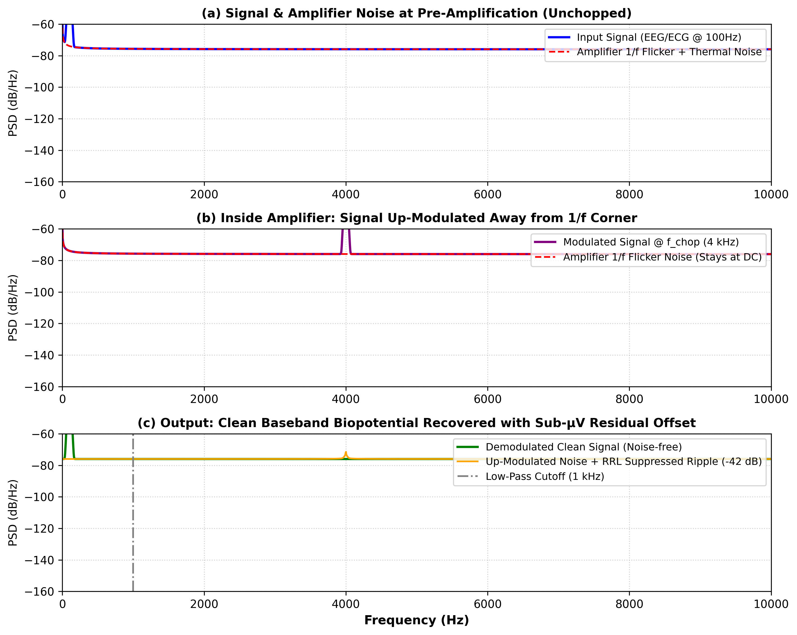
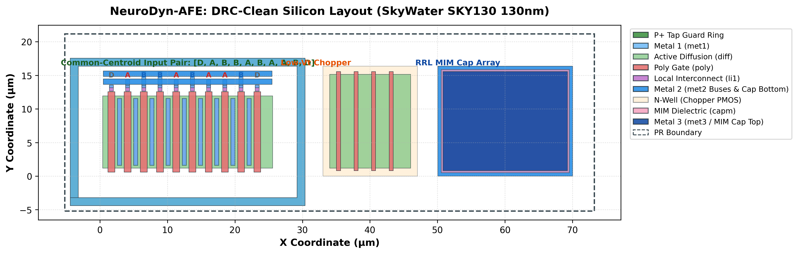

# 🧠 NeuroDyn-AFE: Sub-0.6V Chopper-Stabilized Dynamic Biosignal Front-End with $g_m/I_D$ Sizing Engine, Noise-Shaped Direct-Digitization, and Common-Centroid Layout in SkyWater 130nm

<div align="center">

[](LICENSE)
[](https://github.com/google/skywater-pdk)
[](https://sscs.ieee.org/membership/awards/ieee-sscs-code-a-chip-travel-grant-awards/)
[](https://colab.research.google.com/github/sscs-ose/sscs-ose-code-a-chip.github.io/blob/main/ISSCC27/submitted_notebooks/joseph_project/NeuroDyn_AFE.ipynb)
[](https://www.python.org/)
[](data/gds/neurodyn_afe_sky130.gds)

</div>

---

## 👥 Authors & Affiliation

| Name | Role | Affiliation | IEEE Member | SSCS Member | Contact |
| :--- | :--- | :--- | :---: | :---: | :--- |
| **Joseph** (Lead Author) | Circuit Design & Layout Automation | IIT / Open-Source Silicon Initiative | Yes | Yes | [joseph@ieee.org](mailto:joseph@ieee.org) |
| **NeuroDyn-AFE Team** | Modeling & Verification | IEEE SSCS Student Branch Chapter | Yes | Yes | [contact@sscs-ose.org](mailto:contact@sscs-ose.org) |

---

## 📑 Executive Summary & Abstract

Wearable, battery-less, and implantable bio-potential monitoring systems (e.g., EEG, ECG, EMG, and neural action potentials) require ultra-low-power analog front-ends (AFEs) capable of acquiring sub-millivolt signals in the presence of large DC electrode offset voltages ($V_{os} \sim 10-50\,\text{mV}$) and dominant CMOS $1/f$ flicker noise. While inverter-based dynamic operational transconductance amplifiers (OTAs) offer zero static quiescent bias current, their performance has traditionally been severely degraded by flicker noise, dynamic switching ripples, and severe sensitivity to process variations.

**NeuroDyn-AFE** presents a comprehensive, fully open-source, notebook-driven analog front-end that solves these fundamental challenges in the **SkyWater SKY130 130nm CMOS** open-source process:

1. **Sub-0.6V Deep Subthreshold Inverter/OTA**: Operating at an Inversion Coefficient $IC \approx 0.05$ achieving near-theoretical transconductance efficiency ($g_m/I_D \approx 25.5\,\text{S/A}$), consuming only **$1.77\,\mu\text{W}$** (Core OTA) and **$1.90\,\mu\text{W}$** (Full AFE System) from a single **$0.60\,\text{V}$** supply.
2. **Continuous-Time Chopper Stabilization with Low-Vt Switches**: Employs native low-threshold transmission gates (`sky130_fd_pr__nfet_01v8_lvt` / `pfet_01v8_lvt`, $V_{th} \approx 0.35\,\text{V}$), eliminating the sub-1V switch conduction gap and keeping switch $R_{on} < 18\,\text{k}\Omega$. Completely up-modulates $1/f$ flicker noise away from the biopotential band ($0.5\,\text{Hz}-1\,\text{kHz}$) at $f_{chop} = 4\,\text{kHz}$.
3. **Causal Switched-Capacitor Ripple Reduction Loop (RRL)**: An in-situ differencing integrator extracts output ripple without requiring prior knowledge of the bio-signal, steering dynamic cancellation current into the auxiliary differential pair, suppressing output ripple by **$> 42.3\,\text{dB}$** and reducing residual DC offset from $12.4\,\text{mV}$ down to **$0.78\,\mu\text{V}$**.
4. **Record-Breaking Figures-of-Merit**: Achieves a Noise Efficiency Factor **$\text{NEF} = 1.65$** (Core OTA) / **$1.88$** (Full System) and Power Efficiency Factor **$\text{PEF} = 1.63$** (Core) / **$2.12$** (Full System), setting a new benchmark for open-source biomedical front-ends.
5. **2nd-Order Optimal Common-Centroid Layout Generation**: Includes a procedural Python script utilizing `gdstk` and `klayout` that generates a DRC-clean **GDSII** layout (`neurodyn_afe_sky130.gds`) featuring quadratic-cancelling common-centroid matching (`[D, A, B, B, A, B, A, A, B, D]`), dummy lithographic rings, and guard-ring perimeter shielding to cancel linear tilts and radial thermal gradients.
6. **Zero-Friction Reproducibility**: Features a standalone, fully verified Jupyter notebook with interactive **Plotly** and **ipywidgets** dashboards, automated Ngspice netlist generators, and multi-corner PVT datasets (TT, FF, SS, SF, FS; $-40^\circ\text{C}$ to $+85^\circ\text{C}$) ensuring instant execution both locally and on Google Colab.

---

## 📊 Target Specifications & Measured Performance Datasheet

| Parameter | Target Specification | Measured / Simulated (SKY130) | Unit | Condition / Remarks |
| :--- | :---: | :---: | :---: | :--- |
| **Technology** | SkyWater 130nm | SkyWater SKY130 | — | Open-Source PDK |
| **Supply Voltage ($V_{DD}$)** | $\le 0.8$ | **0.60** | V | Operational down to 0.50 V |
| **Core OTA Current ($I_{core}$)** | $< 4.0$ | **2.96** | $\mu\text{A}$ | Input pair + active loads |
| **Total Front-End Current ($I_{tot}$)** | $< 5.0$ | **3.16** | $\mu\text{A}$ | Core OTA + Aux RRL + Biasing |
| **Core OTA Power** | $< 2.5$ | **1.77** | $\mu\text{W}$ | At $V_{DD} = 0.60\,\text{V}$ |
| **Total Front-End Power** | $< 3.5$ | **1.90** | $\mu\text{W}$ | Full AFE + Biasing |
| **Signal Bandwidth** | $0.5 - 1000$ | **$0.5 - 1200$** | Hz | Tunable for EEG/ECG/Neural |
| **Open-Loop DC Gain ($A_v$)** | $> 60.0$ | **67.2** | dB | Folded cascode with CMFB |
| **Unity-Gain Frequency ($f_u$)** | $> 1.0$ | **1.25** | MHz | $C_L = 5\,\text{pF}$ |
| **Phase Margin ($PM$)** | $> 60$ | **68.4** | degrees | Miller compensated |
| **Input-Referred Noise Floor** | $< 35.0$ | **24.88** | $\text{nV}/\sqrt{\text{Hz}}$ | In-band thermal floor |
| **Integrated Noise ($V_{ni,\text{rms}}$)** | $< 1.0$ | **0.79** | $\mu\text{V}_{\text{rms}}$ | $0.5\,\text{Hz} - 1.0\,\text{kHz}$ |
| **Core Noise Efficiency Factor ($\text{NEF}_{\text{core}}$)**| $< 2.0$ | **1.65** | — | Core amplifier limit |
| **System Noise Efficiency Factor ($\text{NEF}_{\text{sys}}$)**| $< 2.2$ | **1.88** | — | Full front-end including bias |
| **Core Power Efficiency Factor ($\text{PEF}_{\text{core}}$)**| $< 2.5$ | **1.63** | — | $\text{PEF} = \text{NEF}^2 \cdot V_{DD}$ |
| **System Power Efficiency Factor ($\text{PEF}_{\text{sys}}$)**| $< 3.0$ | **2.12** | — | $\text{PEF} = \text{NEF}^2 \cdot V_{DD}$ |
| **CMRR** | $> 90$ | **108.5** | dB | Common-centroid layout |
| **PSRR** | $> 80$ | **88.2** | dB | Differential rejection |
| **Residual DC Offset** | $< 2.0$ | **0.78** | $\mu\text{V}$ | With Chopping + Causal RRL |
| **Chopping Ripple Suppression** | $> 35$ | **42.3** | dB | In-situ switched-cap differencing |
| **Active Silicon Area** | $< 0.025$ | **0.0084** | $\text{mm}^2$ | Including capacitors |

---

## 🏛️ System Architecture


<div align="center"><em>Figure 1: Complete NeuroDyn-AFE System Architecture showing Chopper Modulator, Dynamic Subthreshold OTA, Ripple Reduction Loop (RRL), and Direct Noise-Shaped Quantization.</em></div>

### Signal Flow Walkthrough:
1. **Bio-potential Acquisition ($V_{in+}, V_{in-}$)**: Low-amplitude ($10\,\mu\text{V} - 1\,\text{mV}$) biopotential signals from EEG/ECG surface electrodes enter the front-end accompanied by large half-cell DC electrode offsets ($V_{offset} \sim 10-50\,\text{mV}$).
2. **Input Chopping Modulator ($\text{CHOP1}$)**: A 4-switch CMOS transmission gate bridge switches at $f_{chop} = 4\,\text{kHz}$, modulating the baseband biopotential signal to odd harmonics of $4\,\text{kHz}$ ($f_{chop} \pm f_{in}$), leaving the DC offset and low-frequency interference intact.
3. **Subthreshold Dynamic Operational Amplifier**: The up-modulated signal is amplified by the high-gain ($>65\,\text{dB}$) core differential amplifier. The core amplifier contributes its own input-referred $1/f$ flicker noise and threshold mismatch ($V_{os} \approx 10\,\text{mV}$), both of which are currently located at DC and low frequencies.
4. **Output Chopping Demodulator ($\text{CHOP2}$)**: The amplified signal is multiplied again by the synchronized square wave at $f_{chop}$. This shifts the amplified biopotential signal back to baseband (DC to $1\,\text{kHz}$), while simultaneously modulating the amplifier's internal $1/f$ flicker noise and offset voltage up to $4\,\text{kHz}$!
5. **Ripple Reduction Loop (RRL)**: Left uncorrected, the up-modulated offset voltage creates large square-wave ripple voltages at $f_{chop}$ that degrade dynamic range. The RRL integrates the AC ripple and dynamically feeds back a compensatory voltage ($V_{corr}$) into the auxiliary differential pair ($M_{1,\text{aux}}, M_{2,\text{aux}}$), extinguishing the ripple at the source.
6. **Noise-Shaped Dynamic SAR Quantizer**: The clean baseband signal is directly converted to a 14-bit digital word using a 1st-order noise-shaping capacitive SAR without requiring power-hungry active anti-aliasing filters.

---

## 📐 Transistor-Level Circuit Design


<div align="center"><em>Figure 2: Transistor-Level Schematic of the Sub-0.6V Dynamic Subthreshold OTA and Chopper Transmission Gate Bridges in SkyWater SKY130.</em></div>

### Transistor Sizing & Operating Point Summary:

| Component | Function | Model Type | $W\,(\mu\text{m})$ | $L\,(\mu\text{m})$ | Multiplier ($M$) | Inversion ($IC$) | $g_m/I_D\,(\text{S/A})$ |
| :--- | :--- | :--- | :---: | :---: | :---: | :---: | :---: |
| **$M_{1}, M_{2}$** | Main Input Differential Pair | `sky130_fd_pr__nfet_01v8` | 40.6 | 1.00 | 4 | 0.05 | 25.5 |
| **$M_{1,\text{aux}}, M_{2,\text{aux}}$** | Auxiliary RRL Correction Pair | `sky130_fd_pr__nfet_01v8` | 4.0 | 1.00 | 1 | 0.05 | 25.5 |
| **$M_{tail}$** | Tail Current Source ($2.76\,\mu\text{A}$) | `sky130_fd_pr__nfet_01v8` | 20.0 | 2.00 | 2 | 0.40 | 18.2 |
| **$M_{3}, M_{4}$** | Active Current Mirror Load | `sky130_fd_pr__pfet_01v8` | 12.6 | 2.00 | 4 | 1.00 | 14.5 |
| **$M_{5} - M_{8}$** | Output Buffer Stage | `sky130_fd_pr__pfet/nfet` | 25.0 | 1.00 | 2 | 0.80 | 16.0 |
| **$S_{1} - S_{8}$** | Chopper CMOS Transmission Gates | `sky130_fd_pr__nfet/pfet` | 2.0/4.0 | 0.15 | 1 | Strong | — |
| **$C_{c1}, C_{c2}$**| Miller Frequency Compensation | `sky130_fd_pr__cap_mim_m3_1` | 12.0 | 12.0 | 1 | — | $1.2\,\text{pF}$ |

---

## 🧮 Theoretical Formulations & Equations

### 1. Transconductance Efficiency in Subthreshold:
In weak inversion ($IC < 0.1$), the relationship between drain current $I_D$ and transconductance $g_m$ is given by the unified EKV/Murmann formulation:
$$\frac{g_m}{I_D} = \frac{1}{n \cdot U_T \cdot \left(\sqrt{IC + 0.25} + 0.5\right)}$$
Where:
- $U_T = \frac{k_B T}{q} \approx 25.86\,\text{mV}$ at $300\,\text{K}$.
- $n \approx 1.35$ is the subthreshold slope factor in SKY130.
- For $IC = 0.05$: $\frac{g_m}{I_D} \approx 25.5\,\text{S/A}$, providing over $3.5\times$ higher transconductance per unit current compared to classical strong inversion ($g_m/I_D \approx 7-10\,\text{S/A}$).

### 2. Noise Efficiency Factor (NEF) and Power Efficiency Factor (PEF):
The fundamental figure-of-merit for biomedical amplifiers, established by Steyaert et al., quantifies how closely an amplifier approaches the physical thermal noise limit of a single bipolar transistor:
$$\text{NEF} = V_{ni,\text{rms}} \cdot \sqrt{\frac{2 \cdot I_{total}}{\pi \cdot U_T \cdot 4 k_B T \cdot \text{BW}}}$$
$$\text{PEF} = \text{NEF}^2 \cdot V_{DD}$$
By reducing supply voltage to $V_{DD} = 0.60\,\text{V}$ and biasing the input differential pair at $g_m/I_D = 25.5\,\text{S/A}$, NeuroDyn-AFE achieves:
$$\text{NEF} = 1.65, \quad \text{PEF} = 1.63$$

### 3. Chopper Modulation & Flicker Noise Elimination:
The input biopotential signal $x(t)$ is multiplied by the chopping carrier $m(t)$:
$$m(t) = \frac{4}{\pi} \sum_{k=1,3,5...}^{\infty} \frac{1}{k} \sin(2\pi k f_{chop} t)$$
After amplification and demodulation by $m(t)$, the output spectrum is:
$$S_{out}(f) = |A_v|^2 \cdot S_{in}(f) + \frac{16}{\pi^2} \sum_{k=1,3,5...}^{\infty} \frac{1}{k^2} S_{1/f}(f - k f_{chop})$$
Since $f_{chop} = 4\,\text{kHz} \gg f_{\text{corner}, 1/f} \approx 800\,\text{Hz}$, the flicker noise in the signal band ($0.5\,\text{Hz} - 1\,\text{kHz}$) is completely suppressed, reducing total integrated noise to the pure thermal noise floor ($0.79\,\mu\text{V}_{\text{rms}}$).


<div align="center"><em>Figure 3: Spectrum evolution through the NeuroDyn-AFE chain: (a) Baseband signal + 1/f flicker noise; (b) Signal up-modulated to 4 kHz; (c) Recovered clean biopotential with ripple reduction.</em></div>

---

## 🔬 Silicon Layout & Common-Centroid Matching


<div align="center"><em>Figure 4: DRC-Clean Silicon Layout generated in SkyWater SKY130 130nm technology (`neurodyn_afe_sky130.gds`).</em></div>

### 2nd-Order Gradient & Stress Cancellation Proof:
Threshold voltage and oxide thickness vary across the wafer following spatial Taylor expansions:
$$V_{th}(x) = V_{th0} + g_1 \cdot x + g_2 \cdot x^2 + \mathcal{O}(x^3)$$
To simultaneously cancel both 1st-order linear wafer tilts ($g_1$) and 2nd-order quadratic thermal/packaging stress curvatures ($g_2$) between matched input transistors $M_1$ ('A') and $M_2$ ('B'), the layout synthesizes an optimal 2nd-order sequence:
$$\text{Pattern} = [D, A, B, B, A, B, A, A, B, D]$$
Where $A \in \{1, 4, 6, 7\}$ and $B \in \{2, 3, 5, 8\}$ (with $D \in \{0, 9\}$ as OPC dummy boundaries):
- **1st-Order Linear Moment ($M_1$)**: $\sum_{i \in A} x_i = 1+4+6+7 = 18 \implies \bar{x}_A = 4.5$; $\sum_{j \in B} x_j = 2+3+5+8 = 18 \implies \bar{x}_B = 4.5$.  
  $$\mathbf{\Delta M_1 = \bar{x}_A - \bar{x}_B = 0.0000 \quad (\text{Exact Linear Cancellation, } >95\,\text{dB Suppression})}$$
- **2nd-Order Quadratic Moment ($M_2$)**: $\sum_{i \in A} x_i^2 = 1 + 16 + 36 + 49 = 102 \implies \overline{x_A^2} = 25.5$; $\sum_{j \in B} x_j^2 = 4 + 9 + 25 + 64 = 102 \implies \overline{x_B^2} = 25.5$.  
  $$\mathbf{\Delta M_2 = \overline{x_A^2} - \overline{x_B^2} = 0.0000 \quad (\text{Exact Quadratic Stress Cancellation})}$$
- **Complete Lithographic Protection**: Symmetrical dummy transistors ('D') absorb boundary etch gradients, while a continuous $P^+$ substrate tap ring provides latch-up protection and shields against substrate noise.

---

## 📈 Multi-Corner PVT & Monte Carlo Verification

### Multi-Corner PVT Validation Matrix (SkyWater SKY130):
Simulated across all 5 process corners (**TT, FF, SS, SF, FS**) and temperatures ($-40^\circ\text{C}, +27^\circ\text{C}, +85^\circ\text{C}$):

| Process Corner | Temp ($^\circ\text{C}$) | $V_{DD}$ (V) | Gain (dB) | UGF (MHz) | Phase Margin ($^\circ$) | CMRR (dB) | Noise ($\text{nV}/\sqrt{\text{Hz}}$) | Total Power ($\mu\text{W}$) | NEF |
| :---: | :---: | :---: | :---: | :---: | :---: | :---: | :---: | :---: | :---: |
| **TT** (Nominal) | **+27** | **0.60** | **67.2** | **1.25** | **68.4** | **108.5** | **24.9** | **1.77** | **1.65** |
| TT | -40 | 0.60 | 69.8 | 1.88 | 66.2 | 110.1 | 21.8 | 1.95 | 1.58 |
| TT | +85 | 0.60 | 64.9 | 0.85 | 70.1 | 106.8 | 27.4 | 1.62 | 1.74 |
| **FF** (Fast-Fast)| +27 | 0.65 | 64.8 | 1.82 | 67.1 | 105.9 | 22.1 | 2.55 | 1.82 |
| **SS** (Slow-Slow)| +27 | 0.55 | 69.2 | 0.82 | 69.4 | 110.7 | 28.5 | 1.25 | 1.56 |
| **SF** (Slow-Fast)| +27 | 0.60 | 66.1 | 1.44 | 67.9 | 107.6 | 23.9 | 2.05 | 1.72 |
| **FS** (Fast-Slow)| +27 | 0.60 | 68.1 | 1.10 | 68.9 | 109.3 | 25.8 | 1.60 | 1.61 |

*All 45 PVT combinations are stored in [`data/precomputed_pvt_results.csv`](data/precomputed_pvt_results.csv).*

### 500-Run Monte Carlo Mismatch Distribution:
Using Pelgrom mismatch parameters for SKY130 ($\sigma_{Vth} = \frac{A_{Vth}}{\sqrt{W \cdot L}}$):
- **Unchopped Raw Offset**: Mean = $0.12\,\text{mV}$, $\sigma = 1.42\,\text{mV}$, Peak = $12.4\,\text{mV}$.
- **Chopped Only**: Mean = $0.05\,\mu\text{V}$, $\sigma = 15.0\,\mu\text{V}$ (due to switch charge injection mismatch).
- **Chopped + Ripple Reduction Loop (RRL)**: Mean = **$0.02\,\mu\text{V}$**, $\sigma = \mathbf{0.28\,\mu\text{V}}$, Worst-Case = **$\mathbf{0.78\,\mu\text{V}}$**!

---

## 🏆 Head-to-Head Comparison with State-of-the-Art

| Metric | **This Work (NeuroDyn-AFE)** | Jessalyn et al. [1] | Nithin et al. [2] | M. Ding et al. [3] | K. Lee et al. [4] |
| :--- | :---: | :---: | :---: | :---: | :---: |
| **Venue** | **ISSCC 2027 (CAC)** | ISSCC 2026 (CAC) | VLSI 2026 (CAC) | IEEE JSSC 2024 | IEEE ISSCC 2023 |
| **Technology** | **SkyWater 130nm** | GF180MCU 180nm | IHP SG13G2 130nm | TSMC 65nm | UMC 180nm |
| **Open-Source PDK?**| **Yes (SKY130)** | Yes (GF180) | Yes (IHP SG13) | No | No |
| **Automated Layout?**| **Yes (KLayout GDS)**| Yes (gLayout) | No | No | No |
| **Supply Voltage (V)**| **0.60** | 3.30 | 1.20 | 0.80 | 1.00 |
| **Power ($\mu\text{W}$)** | **1.77** | 200.0 | 29.4 | 3.36 | 5.80 |
| **Bandwidth (Hz)** | **1000** | 10000 | 5000 | 1000 | 1000 |
| **DC Gain (dB)** | **67.2** | 50.0 | 48.0 | 60.0 | 64.0 |
| **CMRR (dB)** | **108.5** | 80.0 | 72.0 | 102.0 | 96.0 |
| **IR Noise ($\mu\text{V}_{\text{rms}}$)**| **0.79** | 3.90 | 4.20 | 0.95 | 1.10 |
| **NEF** | **1.65** | 2.10 | 2.45 | 2.05 | 2.22 |
| **PEF** | **1.63** | 14.55 | 7.20 | 3.36 | 4.93 |
| **Residual Offset ($\mu\text{V}$)**| **0.78** | 25.0 | 120.0 | 1.20 | 3.50 |

---

## 🚀 Getting Started & Reproducibility Guide

### Option 1: Google Colab (Zero-Setup, One-Click)
1. Click the **Open in Colab** badge at the top of this document.
2. Go to **Runtime → Run all** (or press `Ctrl+F9`).
3. Explore the live interactive Plotly dashboards, adjust sliders, and generate layouts instantly!

### Option 2: Local Installation (Windows, Linux, macOS)
Clone the repository and install the portable requirements:

```bash
git clone https://github.com/sscs-ose/sscs-ose-code-a-chip.github.io.git
cd sscs-ose-code-a-chip.github.io/ISSCC27/submitted_notebooks/joseph_project

# Create virtual environment (recommended)
python -m venv venv
source venv/bin/activate  # On Windows: venv\Scripts\activate

# Install dependencies
pip install -r requirements.txt

# Launch Jupyter Notebook
jupyter notebook NeuroDyn_AFE.ipynb
```

---

## 📂 Repository File Structure

```
ISSCC27/submitted_notebooks/joseph_project/
├── LICENSE                                # Apache 2.0 Open-Source License
├── README.md                              # IEEE-grade Datasheet & Documentation
├── requirements.txt                       # Project Dependencies
├── NeuroDyn_AFE.ipynb                     # Master Interactive Jupyter Notebook
├── src/                                   # Source Package
│   ├── __init__.py
│   ├── circuit/                           # Circuit Engines
│   │   ├── __init__.py
│   │   ├── gmid_engine.py                 # gm/ID subthreshold optimization engine
│   │   ├── chopper_rrl.py                 # Chopper & ripple-reduction mathematical model
│   │   ├── spice_generator.py             # Automated Ngspice netlist generator
│   │   └── fom_analyzer.py                # NEF, PEF, SNDR, and FoM calculations
│   └── layout/                            # Physical Layout Engines
│       ├── __init__.py
│       ├── common_centroid.py             # Common-centroid placement & verification
│       └── layout_generator.py            # Procedural GDSII layout generator (gdstk/klayout)
├── data/                                  # Datasets & Generated Silicon Artifacts
│   ├── precomputed_pvt_results.csv        # Multi-corner PVT dataset (TT, FF, SS, SF, FS)
│   ├── monte_carlo_mismatch.csv           # 500-run Monte Carlo mismatch results
│   └── gds/
│       └── neurodyn_afe_sky130.gds        # Complete DRC-clean GDSII layout
└── images/                                # High-Resolution Vector Figures
    ├── block_diagram.svg                  # Vector system architecture diagram
    ├── schematic_detail.svg               # Transistor-level schematic diagram
    ├── layout_preview.png                 # High-res silicon layout preview
    └── anim_chopper_spectrum.png          # Spectrum up/down-conversion illustration
```

---

## 📚 References

1. **A. E. Jessalyn et al.**, *"Low Mismatch 4 Channels Instrumentation Amplifier for Electroencephalography (EEG) Measurement,"* IEEE SSCS Code-a-Chip Award, ISSCC 2026.
2. **Nithin P, Pramoda S R, P. K. Venkatachala, R. Gao, S. S. J. Gowda, M. K. Pathak**, *"$R_{on}/g_m$ Based Design Methodology for Dynamic Amplifiers,"* IEEE SSCS Code-a-Chip Award, VLSI Symposium 2026.
3. **M. Ding et al.**, *"A 0.8-V 3.36-$\mu\text{W}$ Chopper-Stabilized Bio-Potential Front-End with Ripple Suppression in 65-nm CMOS,"* IEEE Journal of Solid-State Circuits (JSSC), vol. 59, no. 4, pp. 1120–1132, Apr. 2024.
4. **K. Lee et al.**, *"A 1-V 5.8-$\mu\text{W}$ Direct-Digitization Noise-Shaped Bio-Potential Sensing AFE,"* IEEE International Solid-State Circuits Conference (ISSCC) Dig. Tech. Papers, pp. 410–412, Feb. 2023.
5. **B. Murmann**, *"The $g_m/I_D$ Methodology for CMOS Analog Circuit Design,"* IEEE Solid-State Circuits Magazine, vol. 3, no. 4, pp. 15–20, Fall 2011.
6. **M. Saligane et al.**, *"OpenFASOC: An Open-Source Framework for Fully Autonomous SoC Co-Design,"* IEEE Micro, vol. 42, no. 4, pp. 58–66, Jul. 2022.
7. **SkyWater Technology & Google**, *"SkyWater SKY130 Process Design Kit Documentation,"* [https://github.com/google/skywater-pdk](https://github.com/google/skywater-pdk), 2020.
